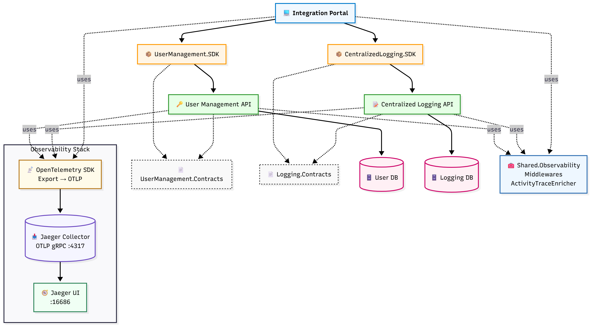
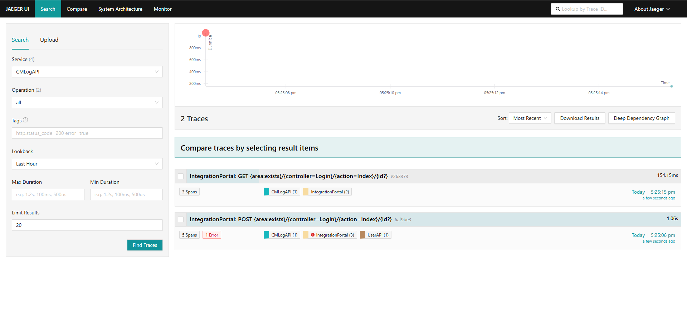

# 🛰️ Centralized Observability Platform

[](https://github.com/hasanjaved-developer/CentralizedLoggingMonitoring/actions/workflows/dotnet-tests.yml)
[](https://codecov.io/gh/hasanjaved-developer/CentralizedObservability)
[](https://github.com/hasanjaved-developer/CentralizedObservability/actions/workflows/docker-compose-ci.yml)
[](LICENSE.txt)
[](https://github.com/hasanjaved-developer/CentralizedObservability/tags)
[](https://ghcr.io/hasanjaved-developer/centralized-observability/api)
[](https://ghcr.io/hasanjaved-developer/centralized-observability/userapi)
[](https://ghcr.io/hasanjaved-developer/centralized-observability/web)

### 🐳 Docker Hub Images

| Service | Pulls | Size | Version |
|----------|-------|------|----------|
| **API** | [](https://hub.docker.com/r/hasanjaveddeveloper/centralized-observability-api) | [](https://hub.docker.com/r/hasanjaveddeveloper/centralized-observability-api/tags) | [](https://hub.docker.com/r/hasanjaveddeveloper/centralized-observability-api/tags) |
| **User API** | [](https://hub.docker.com/r/hasanjaveddeveloper/centralized-observability-userapi) | [](https://hub.docker.com/r/hasanjaveddeveloper/centralized-observability-userapi/tags) | [](https://hub.docker.com/r/hasanjaveddeveloper/centralized-observability-userapi/tags) |
| **Web (Portal)** | [](https://hub.docker.com/r/hasanjaveddeveloper/centralized-observability-web) | [](https://hub.docker.com/r/hasanjaveddeveloper/centralized-observability-web/tags) | [](https://hub.docker.com/r/hasanjaveddeveloper/centralized-observability-web/tags) |

The **Centralized Observability Platform** is a .NET 9 proof-of-concept that demonstrates **unified observability practices across services—**with **structured logging** (Serilog file sinks) and **distributed tracing** (OpenTelemetry → **Jaeger**). Metrics are planned for a subsequent phase.

Evolving from the earlier Centralized Logging & Monitoring work, this repo adds **full trace visualization** and **request correlation** across services, enabling end-to-end debugging through Jaeger while keeping logs locally for now.

**CI/CD:** GitHub Actions builds and publishes **amd64** Docker images using Buildx (QEMU pre-setup for future multi-arch). **Tag-based builds** are pushed to **GHCR** and optionally mirrored to **Docker Hub**. The repo provides **separate Docker Compose stacks** for each registry, enabling quick environment setup and validation.

---

## 🧭 Overview

The **Centralized Observability Platform** is a modern observability showcase built with **.NET 9**, featuring structured logging, distributed tracing, and trace visualization integrated through Jaeger.

It extends the earlier **Centralized Logging & Monitoring API** project with:

- 🧠 **Centralized ActivityTraceEnricher** automatically enriches logs with TraceId and SpanId for distributed correlation
- ⚙️ **Centralized Exception & Audibility Middleware** ensures consistent error handling and request/response logging across all APIs
- ✅ **Serilog** for structured logging  
- 🟣 **Jaeger (via OpenTelemetry)** for distributed tracing  
- 🧩 **Docker Compose stack** for local observability setup  
- 🚀 **GitHub Actions CI/CD** for image builds and tests  
- 📊 **Codecov** integration for coverage insights  

---

## 🧱 Tech Stack

| Category | Technology | Description |
|-----------|-------------|-------------|
| **Framework** | [.NET 9](https://dotnet.microsoft.com/) | Latest LTS runtime |
| **Logging** | [Serilog](https://serilog.net/) | Structured logs with enrichment and sinks |
| **Tracing** | [Jaeger](https://www.jaegertracing.io/) + [OpenTelemetry](https://opentelemetry.io/) | Distributed trace instrumentation |
| **Containerization** | [Docker Compose](https://docs.docker.com/compose/) | Multi-service orchestration |
| **CI/CD** | [GitHub Actions](https://github.com/features/actions) | Automated build, test, and publish pipelines |
| **Code Coverage** | [Codecov](https://about.codecov.io/) | Visual test coverage tracking |
| **Package Registry** | [GHCR](https://ghcr.io) + [Docker Hub](https://hub.docker.com/) | Public image hosting |

---

## 🧩 Architecture Snapshot

  
<sub>[View Mermaid source](docs/integration_portal_architecture.mmd)</sub>

---

### 📸 Screenshots

### 🔑 Login Page



---

## 🔍 Quick Start (Preview)

```bash
# Clone the repository
git clone https://github.com/hasanjaved-developer/centralized-observability.git
cd centralized-observability

# Start the observability stack
docker compose -f docker-compose.yml up -d
```
---

## 📜 License

This project is licensed under the MIT License.

---
